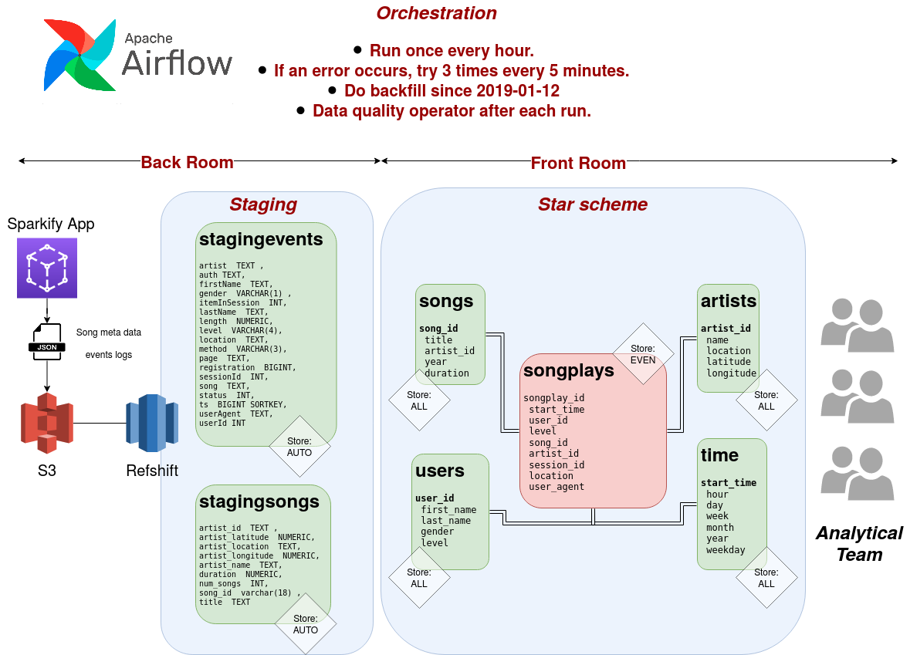

# AirFLow DAG for Sparkify ETL.
Project: Data Pipelines with Airflow

A music streaming company, Sparkify, has decided that it is time to introduce 
more automation and monitoring to their data warehouse ETL pipelines and come 
to the conclusion that the best tool to achieve this is Apache Airflow.

In this project we created high-grade data pipelines that are dynamic and built 
from reusable tasks, can be monitored, and allow easy backfills. a data quality 
operator is implemented to report volume discrepancies in real-time.

The source datasets consist of JSON logs that tell about user activity in the 
application and JSON metadata about the songs the users listen to.

## General code description
This project uses custom airflow operators to load once an hour data from
S3 to the stagging area of Redshift. This process was done already on a ad hoc manner
for project 3 of the nano degree of data engineering. Please visit that project repository
for more information https://github.com/gariciodaro/redshift-Sparkify-data-warehouse.


## directed acyclic graphs (DAG) in AirFlow.
<div>

</div>


## Project model.
<div>

</div>

## Files.

```
├── schema.png
├── dag.png
├── dags
│   ├── create_tables_dag.py
│   └── etl_dag.py
├── plugins
│   ├── helpers
│   │   ├── __init__.py
│   │   └── sql_queries.py
│   ├── __init__.py
│   └── operators
│       ├── data_quality.py
│       ├── __init__.py
│       ├── load_dimension.py
│       ├── load_fact.py
│       └── stage_redshift.py
└── README.md

```

+ create_tables_dag.py. Dag to initialize the data base start schema as well as stagging area on Redshift.
+ etl_dag.py. Main Dag, run to extract data from S3 json, and deposits on the data wareshouse.
+ sql_queries.py. auxiliar sql queries (postgresql) to do insertion on dimentional and fact tables.
+ data_quality.py. Postgres operator to do volumne check of tables.

## Notes.
+ aws_credentials hook(amazon web server hook) was created using airflow webserver.  
+ redshift hook(postgres) must aldo be creates. When setting configuration on AWS, pass host
dbname, dbpass to this hook.